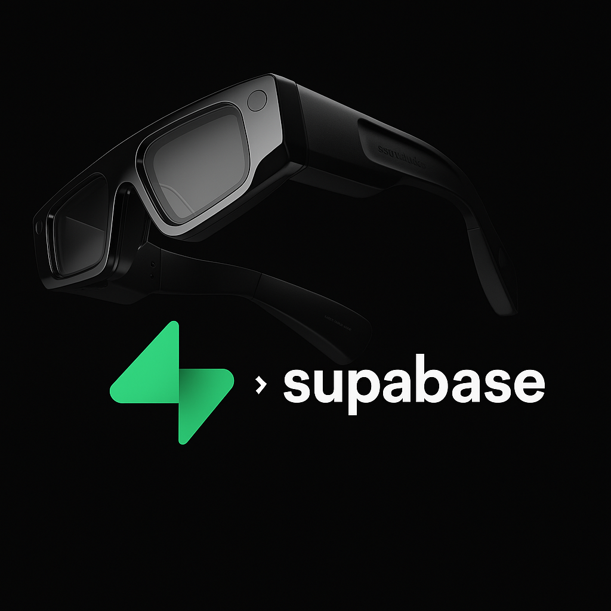
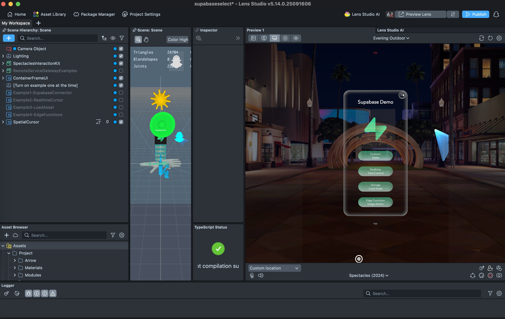
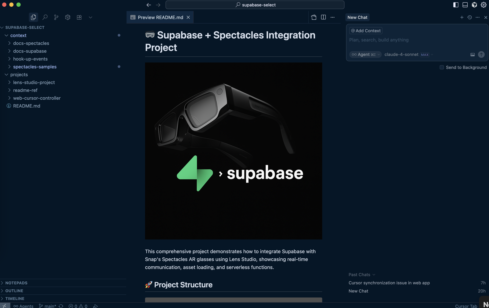

# 🥽 Supabase + Spectacles Integration Project



This comprehensive project demonstrates how to integrate Supabase with Snap's Spectacles AR glasses using Lens Studio, showcasing real-time communication, asset loading, and serverless functions.

## 🚀 Project Structure

```
supabase-select/
├── projects/
│   ├── lens-studio-project/           # Main Lens Studio Project
│   │   └── Assets/Supabase/
│   │       ├── Example1-SupabaseConnector/    # Basic database integration
│   │       ├── Example2-RealTimeCursor/       # Real-time cursor sync
│   │       ├── Example3-LoadAssets/           # 3D models, images, audio loading
│   │       └── Example4-EdgeFunctions/        # Serverless function calls
│   └── web-cursor-controller/         # PC Web Controller
│       ├── index.html                 # Web interface with smooth cursor
│       ├── supabase-client.js        # Enhanced client
│       └── README.md                 # Web controller setup
├── context/                          # Documentation & References
│   ├── docs-supabase/               # Supabase API documentation
│   ├── docs-spectacles/             # Spectacles development guides
│   └── spectacles-samples/          # Official Spectacles examples
└── data/                            # Sample CSV data for testing
```

## 🎓 Developer Tips - Getting Started



### 🛠️ Essential Tools & Setup

#### 1. **Download Lens Studio 5.12.1**
Get the latest version of Lens Studio to ensure compatibility with all features:
- [Download Lens Studio 5.12.1]([https://ar.snap.com/lens-studio-dl?utm_source=GooglePM&utm_medium=PAIDPLATFORM&utm_campaign=LensStudio_PM_P0_RET&utm_term=Retargeting_LS_Downloaders&utm_content=LS_ProductPage&gad_source=1&gad_campaignid=22443428343&gbraid=0AAAAADGpnVGSjGB7_qLWN6ZtsHbOIQPh5&gclid=CjwKCAjw6P3GBhBVEiwAJPjmLps2SgE89H9XPRV38dnea-AbjzkCjO7rKr2FqODPXMRib6ZjdOVIJBoCVQkQAvD_BwE](https://ar.snap.com/older-versions))

#### 2. **Create a Snapchat Account**
You'll need a Snapchat account to develop for Spectacles:
- [Spectacles Documentation Home](https://developers.snap.com/spectacles/home)

#### 3. **Download the Context Folder**
Essential documentation and references for AI-assisted development:
- [Download Context Folder](https://we.tl/t-uR1fXu49Hj)



Drag and drop these files when you ask questions. 

### 🤖 Power Your Development with AI (Cursor)

#### **Use Cursor IDE with Context-Aware AI**
For the best development experience, we highly recommend using **Cursor IDE** with the downloaded context folder. This enables AI-powered assistance that understands both Lens Studio and Supabase APIs.

#### **Enable Documentation Indexing**
Use Cursor's documentation indexing feature to make the AI chat more knowledgeable:

**Index these documentation sources:**
1. [Lens Studio API Documentation](https://developers.snap.com/lens-studio/api/lens-scripting/index.html)
2. [Supabase API Guide](https://supabase.com/docs/guides/api)

💡 **Pro Tip**: With proper indexing, the AI can help you write code, debug issues, and suggest best practices specific to Spectacles and Supabase integration!

### 📺 Learning Resources

#### **Video Tutorials**
Learn from video guides on AR development:
- [1fficial AR YouTube Channel](https://www.youtube.com/@1fficialar)

#### **Community Support**
Join the Spectacles community for help and inspiration:
- [r/Spectacles - Official Reddit Community](https://www.reddit.com/r/Spectacles/)

#### **Hackathon Resources**
Building for a hackathon? Check out these resources:
- [Spectacles Hackathon Resources](https://developers.snap.com/spectacles/spectacles-community/hackathon-resources)

---

## 🎯 Complete Example Collection

### 1. 🔌 Basic Database Integration
**Location**: `Example1-SupabaseConnector/`


**Features:**
- Database CRUD operations (Create, Read, Update, Delete)
- Real-time messaging and broadcasting
- User interaction logging and analytics
- Connection testing and error handling
- Sample data import and management

**Use Cases:**
- User data storage and retrieval
- Analytics and interaction tracking
- Basic real-time messaging
- Database connectivity testing

### 2. 🎯 Real-Time Cursor Synchronization
**Location**: `Example2-RealTimeCursor/`


**Features:**
- **PC → Spectacles**: Mouse movements control AR objects
- **Spectacles → PC**: AR object movements control web cursor
- Bidirectional synchronization with smooth lerping
- Multi-user support with unique colors
- Configurable coordinate mapping and sensitivity
- Room-based isolation for multiple sessions

**Use Cases:**
- Remote AR object control
- Collaborative design tools
- Presentation and demonstration systems
- Multi-user AR experiences

### 3. 📦 Dynamic Asset Loading
**Location**: `Example3-LoadAssets/`


**Features:**
- **3D Models**: Load GLTF/GLB models from Supabase Storage
- **Images**: Load and display textures dynamically
- **Audio**: Load and play audio files on demand
- Pinch button interaction triggers
- Automatic positioning and scaling
- Progress tracking and error handling
- Service key support for bypassing RLS policies

**Use Cases:**
- Dynamic content loading
- User-generated content display
- Asset streaming for large AR experiences
- Content management systems

### 4. ⚡ Serverless Edge Functions
**Location**: `Example4-EdgeFunctions/`


**Features:**
- Call Supabase Edge Functions from Lens Studio
- Image processing with ImageMagick (resize, blur effects)
- Real image download and processing pipeline
- Button-triggered serverless computing
- Binary data handling and conversion
- Error handling and timeout management

**Use Cases:**
- Image processing and filters
- AI/ML model inference
- Complex business logic execution
- External API integrations

### 5. 🌐 Web Cursor Controller
**Location**: `web-cursor-controller/`

**Features:**
- Smooth cursor interpolation with configurable lerp speed
- Leader/Follower mode switching
- Real-time coordinate display and conversion
- Responsive web interface
- Touch and mouse support
- Connection status monitoring

## 🛠️ Quick Start

### Universal Setup Steps

1. **Create Supabase Project**:
   - Go to [supabase.com](https://supabase.com)
   - Create new project
   - Copy Project URL and anon public key

2. **Open Lens Studio Project**:
   - Import `lens-studio-project/MyProject.esproj`
   - Add InternetModule to project
   - Set Device Type Override to Spectacles

3. **Choose Your Example**:
   - Each example has its own README with specific setup
   - Start with Example1 for basic connectivity
   - Progress to more advanced examples

## 📚 Example Setup Guides

### 🔌 Example1: Database Integration
```bash
# 1. Create 4 database tables (test_messages, realtime_messages, etc.)
# 2. Configure SupabaseConnector script with credentials
# 3. Run lens to test connection and CRUD operations
# 4. Check Supabase Dashboard for inserted test data
```

### 🎯 Example2: Real-Time Cursor
```bash
# 1. Create cursor_positions table
# 2. Configure RealtimeCursorFollower for PC → Spectacles
# 3. Configure RealtimeCursorBroadcaster for Spectacles → PC
# 4. Start web-cursor-controller for bidirectional sync
# 5. Test mouse movements and AR object control
```

### 📦 Example3: Asset Loading
```bash
# 1. Create Supabase Storage bucket (specs-bucket)
# 2. Upload 3D models, images, and audio files
# 3. Configure storage policies for public access
# 4. Configure SupabaseAssetLoader script
# 5. Press pinch button to load assets dynamically
```

### ⚡ Example4: Edge Functions
```bash
# 1. Deploy Edge Function for image processing
# 2. Configure EdgeFunctionCall script
# 3. Set up input/output Image components
# 4. Press process button to call serverless function
# 5. View processed images in AR
```

## 🗄️ Database Requirements

### Core Tables (Example1)
- `test_messages` - Basic messaging and CRUD testing
- `realtime_messages` - Real-time event broadcasting
- `user_interactions` - User analytics and tracking
- `user_preferences` - User settings and preferences

### Specialized Tables
- `cursor_positions` - Real-time cursor coordinates (Example2)

### Storage Buckets
- `specs-bucket` - 3D models, images, audio files (Example3)
  - `public/models/` - GLTF/GLB 3D models
  - `public/images/` - PNG/JPG textures
  - `public/audio/` - MP3/WAV audio files

### Edge Functions
- `specs-example-image-transformation` - ImageMagick processing (Example4)

## 🔧 Universal Configuration

### Supabase Setup (All Examples)
1. **Project URL**: `https://your-project-id.supabase.co`
2. **Anon Public Key**: From Settings > API
3. **Storage Bucket**: `specs-bucket` (for Example3)
4. **RLS Policies**: Configure for production security

### Lens Studio Setup (All Examples)
1. **InternetModule**: Required for all HTTP requests
2. **Spectacles Interaction Kit**: For button interactions
3. **Device Type Override**: Set to Spectacles for preview
4. **Scene Objects**: Assign appropriate objects for each example

## 🌟 Real-World Applications

### 🎮 Gaming & Entertainment
- **Multiplayer AR Games**: Shared virtual spaces
- **Remote Control Systems**: PC-assisted AR gameplay
- **Interactive Storytelling**: Dynamic content loading
- **Social AR Experiences**: Multi-user interactions

### 💼 Business & Productivity
- **Collaborative Design**: 3D model review and annotation
- **Presentation Tools**: Remote AR presentation control
- **Training Systems**: Interactive learning with asset loading
- **Data Visualization**: Real-time analytics in AR

### 🎓 Education & Research
- **Virtual Laboratories**: Dynamic experiment setups
- **Interactive Lessons**: Asset-rich educational content
- **Research Tools**: Data collection and real-time analysis
- **Accessibility Tools**: Enhanced interaction methods

### 🏭 Industrial Applications
- **Remote Assistance**: Expert guidance through AR
- **Asset Management**: Dynamic 3D model loading
- **Quality Control**: Image processing and analysis
- **Maintenance Systems**: Real-time data and instructions

## 📖 Comprehensive Resources

### 📚 Supabase Documentation
- [Database Guide](https://supabase.com/docs/guides/database) - PostgreSQL operations
- [Storage Guide](https://supabase.com/docs/guides/storage) - File management
- [Edge Functions](https://supabase.com/docs/guides/functions) - Serverless computing
- [Real-time](https://supabase.com/docs/guides/realtime) - Live data subscriptions

### 🔧 API References
- [PostgREST API](https://postgrest.org/en/stable/api.html) - Database REST interface
- [Supabase JavaScript Client](https://supabase.com/docs/reference/javascript/introduction) - Client library
- [Storage API](https://supabase.com/docs/reference/javascript/storage-createbucket) - File operations

---

## 🎉 **You're Ready to Build the Future!**

This project provides everything you need to create sophisticated AR experiences with real-time data, dynamic content, and serverless computing. Each example builds upon the previous ones, creating a comprehensive foundation for production AR applications.

**Happy building!** 🚀✨
